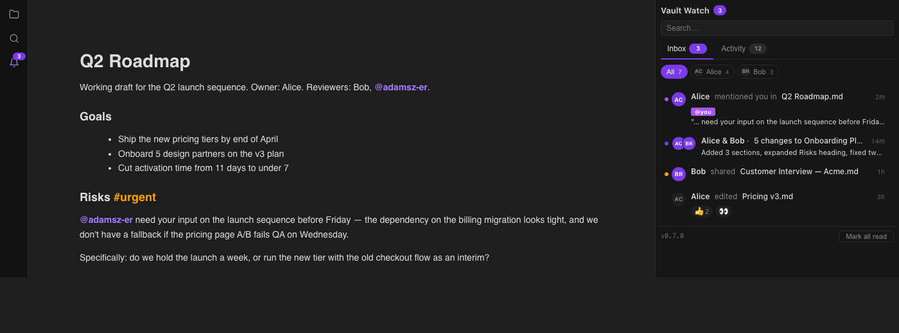
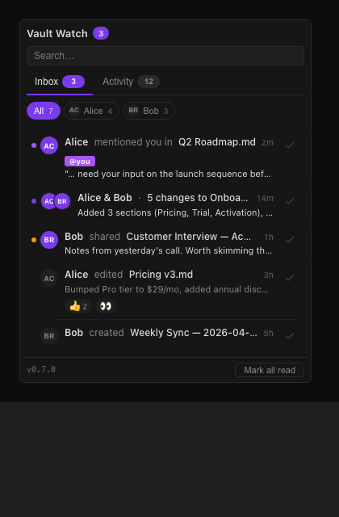
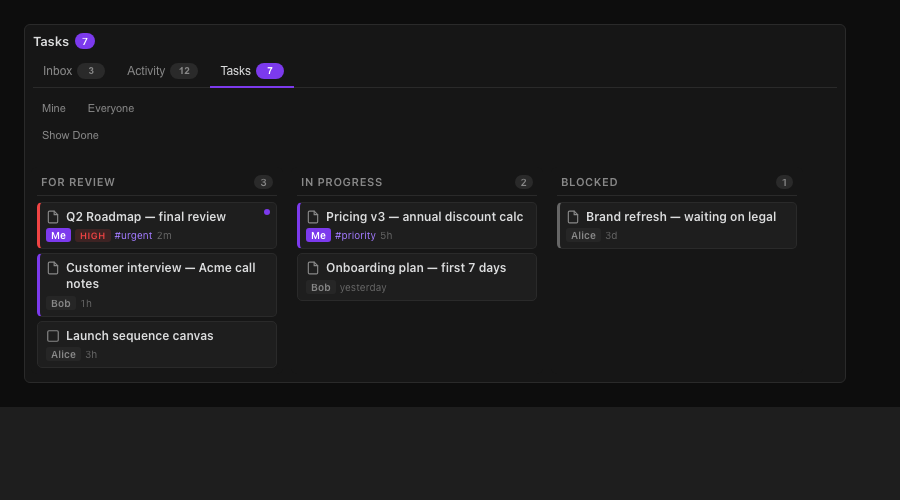
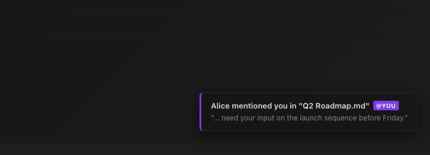
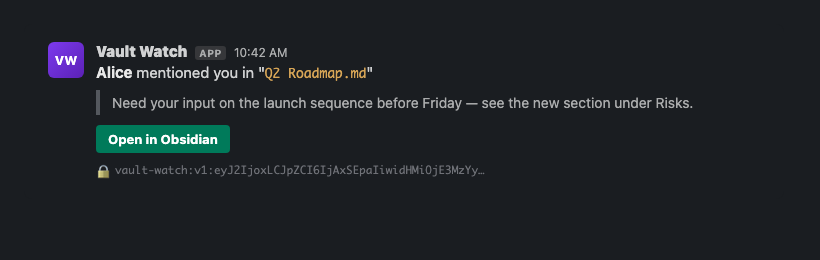
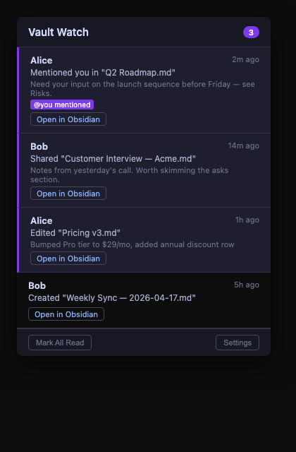

# Vault Watch

[](https://github.com/adamsz-er/vault-watch/actions/workflows/ci.yml)
[](./LICENSE)

**Notification and inbox system for shared Obsidian vaults.** Get alerted to meaningful vault changes through Obsidian, Slack, and Chrome — with zero infrastructure and end-to-end encryption.



> See [ARCHITECTURE.md](./ARCHITECTURE.md) for the design and threat model · [CONTRIBUTING.md](./CONTRIBUTING.md) to hack on it · [CHANGELOG.md](./CHANGELOG.md) for what's new.

---

## How it works

The vault **is** the message bus. When you edit a file, Vault Watch debounces the event, summarises the meaningful change, encrypts it for each teammate using their public key, and writes the envelope to `Z_Meta/vault-watch/outbox/`. Obsidian Relay (CRDT) syncs that folder to every teammate's vault. Their plugin reads `inbox/<their-id>/`, decrypts, and shows a toast + inbox card. Optional fan-outs (Slack webhook, Chrome extension) get the same encrypted payload.

```
Edit → Debounce → Coalesce → Diff → Encrypt ──► outbox/  ─sync─►  inbox/  → toast + card
                                            ├─► Slack (encrypted payload in context block)
                                            └─► Chrome ext (reads payload from Slack DOM)
```

**No servers. No accounts. No central database.** Private keys live on your device only; the relay sees encrypted blobs.

---

## Features

### Inbox sidebar — your activity hub



A three-tab sidebar in Obsidian (`Ctrl+Shift+N`):

- **Inbox** — your folder-backed task queue (what needs your attention).
- **Activity** — full event feed with sub-filters (All / To me / Additions / Edits / Deletes), per-person filter chips, and search.
- **Chat** — Slack-style chat with threads, `@mentions`, and `#` deep-links to vault notes (see below).

Cards are click-to-open (no Open button noise), hover reveals Reply / React / overflow menu, and consecutive edits to the same file within an hour stack into one expandable card — even across different senders ("Alice & Bob · 5 changes to plan.md"). Color-coded left dot indicates event type at a glance.

### Chat — quick, in-vault conversation

A mini Slack-style chat as a third tab alongside Inbox and Activity. Built for quick coordination without leaving Obsidian.

- **Single shared channel** with **threaded replies** — click "N replies" on any message to open a focused thread view.
- **`@mentions`** — type `@` to pick from the member list; mentioned recipients get a high-priority toast.
- **`#` deep-links** — type `#` to pick any note or folder in the vault; inserts a chip that opens the note (or reveals the folder) on click.
- **Chat about this** — right-click any note or folder (or use the command palette on an open note) to jump straight to the Chat tab with that `#ref` pre-inserted, ready for you to type.
- **End-to-end encrypted** — chat rides the same TweetNaCl sealed-box envelope as notifications, so the security model is identical.
- **Local history** — each member stores their own chat history in `inbox/<id>/`. Chat messages don't pollute Inbox or Activity lists or badges.

### Folder-backed Tasks



Adapts to whatever inbox folder structure you already use, e.g. `0 - INBOX/Alice/1 - FOR REVIEW/`. **Folders are the state machine** — one click advances a task to the next lane via `app.vault.rename` (CRDT-safe, no metadata to keep in sync). Multi-root supported, hides Done by default, treats `.canvas` files as tasks, surfaces "recently edited" activity dots pulled from the notification inbox.

### Notifications that respect attention



- **Toasts** appear in Obsidian on every new event (8s for high-priority, 5s otherwise).
- **Two-tone audio ping** for high-priority, configurable volume.
- **Do Not Disturb** toggle suppresses both — via command palette, settings, or status bar.
- **Snooze 1h** on any card; re-appears later.
- **Quick reactions** (👍 ✅ 👀 ❗) from inbox cards; sender gets notified.
- **Reply** opens the file with `@sender` pre-inserted at the bottom.
- **Ribbon badge + status bar** show unread count; both turn red when there's something to read.
- **Keyboard shortcuts** — `Ctrl+Shift+N` open inbox, `Ctrl+Shift+J` jump to next unread.

### Mentions, priority, and sharing

- **`@mention` autocomplete** as you type — triggers a high-priority toast for that member.
- **`#urgent` / `#priority` tags** (inline or in frontmatter) escalate any change.
- **Right-click → Send to Vault Watch** on any file or folder to share manually.

### Anti-spam by design

Three coalescing layers keep notifications meaningful instead of constant:

| Layer | Window | What it does |
|---|---|---|
| Per-file debounce | 2s | Multiple keystrokes on one file collapse into one event |
| Session coalesce | 30s | Cumulative diff across a burst of edits |
| Slack batch | 5 min | One Slack message per batch (high-priority bypasses) |

Plus **smart diff** ignores whitespace and Relay CRDT artifacts, **activity sensitivity** controls (minimum edit size, hide trivial/sync, glob-pattern path ignores, per-event-type mutes), and **frontmatter/inline tag** detection that escalates real urgency.

### Privacy

- **End-to-end encrypted** with TweetNaCl sealed box (X25519 + XSalsa20-Poly1305). Each event is encrypted separately for each recipient.
- **Ed25519 signatures** verify sender identity before anything renders.
- **Private keys never leave your device.** Public keys publish to `Z_Meta/vault-watch/keys/`. The relay sees only encrypted blobs and timestamps. Slack sees a generic "Vault activity" message with the encrypted payload tucked in a context block.

See [ARCHITECTURE.md](./ARCHITECTURE.md) for the full threat model.

### Slack & Chrome (optional)





- **Slack** — Block Kit message with the change summary + an "Open in Obsidian" deep link. Encrypted payload sits in a context block so the Chrome extension can decrypt it.
- **Chrome extension** (MV3) — runs on `app.slack.com`, scrapes payloads from Slack DOM via `MutationObserver`, decrypts locally, shows desktop notifications + a popup inbox.

---

## Install (Obsidian Plugin)

### Option A: BRAT (recommended)

1. Install [BRAT](https://github.com/TfTHacker/obsidian42-brat) from Community Plugins.
2. BRAT settings → **Add Beta Plugin** → enter `adamsz-er/vault-watch` → **Add Plugin**.
3. Enable **Vault Watch** in Community Plugins.

Updates are automatic on Obsidian restart.

### Option B: Manual

1. Download `main.js`, `manifest.json`, and `styles.css` from the [latest release](https://github.com/adamsz-er/vault-watch/releases/latest).
2. Create `<your-vault>/.obsidian/plugins/vault-watch/` and drop the three files in.
3. Restart Obsidian → enable **Vault Watch**.

## Setup (first time)

When you first enable the plugin, a **welcome modal** pops up — pick a display name, confirm the auto-suggested member ID (live-checked against existing members), click **Join team**. Keys are generated on your device and your member file is written to the vault. That's it.

If you dismiss the modal, the sidebar (`Ctrl+Shift+N`) shows a persistent **"Finish setup"** card and the ribbon icon gets an amber dot — both reopen the modal when clicked.

Power users: everything in the modal is also in **Settings → Vault Watch → Identity**, plus per-event mutes, Slack, Inbox Tasks, etc.

## Joining an existing team

1. Get an Obsidian Relay invite to the shared vault, accept it, wait for sync.
2. Install the plugin (BRAT instructions above) and **enable** it.
3. The setup modal auto-opens — it lists members already on the vault so you can pick a non-taken ID. Click **Join team**.

Existing members get a "new member" toast within ~5s.

## Slack integration (optional)

1. Create a [Slack Incoming Webhook](https://api.slack.com/messaging/webhooks) for your `#vault-watch` channel.
2. Paste the URL in Vault Watch settings → enable Slack notifications.

## Chrome extension (optional)

1. Build:
   ```bash
   cd vault-watch-chrome && npm install && npm run build
   ```
2. `chrome://extensions` → Developer Mode → **Load unpacked** → select `vault-watch-chrome/`.
3. Click the extension icon → paste your private key JSON (Obsidian → Vault Watch settings → **Export private key**).

---

## Platform support

Built and tested on **macOS Obsidian (desktop)**. The plugin is desktop-first — `isDesktopOnly: false` in the manifest so mobile loads it, but the inbox sidebar and tasks view are designed for a desktop layout. Mobile usage is best-effort; PRs welcome to make it first-class.

The Chrome extension targets desktop Chrome on macOS, Windows, and Linux.

## Contributing

See [CONTRIBUTING.md](./CONTRIBUTING.md) for dev setup, coding conventions, and the CRDT-safety rules.
